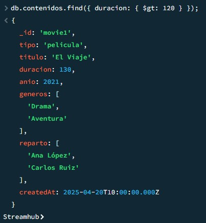
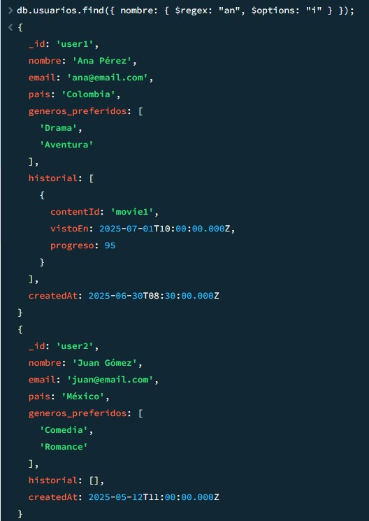
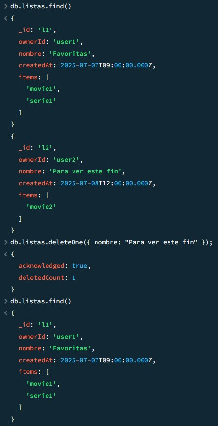
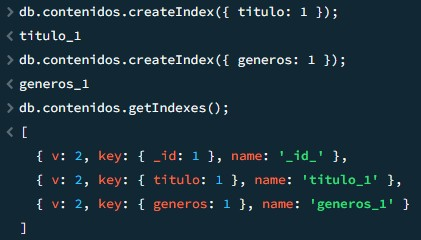
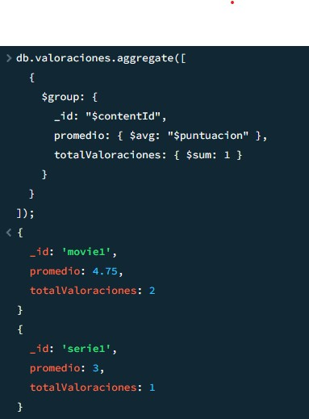

# 📺 StreamHub – Gestión de Contenidos y Usuarios en MongoDB

Proyecto de práctica usando **MongoDB** para gestionar datos de una plataforma de streaming ficticia.  
Incluye operaciones CRUD, creación de índices y agregaciones.

## 📌 Contenido
La base de datos `streamhub` contiene:
- **usuarios** → información de los usuarios y su historial de visualización.
- **contenidos** → películas y series con datos como título, duración, géneros y reparto.
- **valoraciones** → puntuaciones y comentarios de usuarios.
- **listas** → listas personalizadas creadas por usuarios.

## ⚙️ Funcionalidades
- Inserción y consulta de documentos.

- Filtros con operadores (`$gt`, `$lt`, `$regex`, etc.).

  

- Actualizaciones (`updateOne`, `updateMany`) y eliminaciones (`deleteOne`, `deleteMany`).
  

  

- Creación de índices para búsquedas rápidas.
 

- Agregaciones para generar métricas (promedios, conteos, géneros más populares).
 

## 🚀 Ejecución
1. Crear la base `streamhub` en MongoDB.
2. Importar los archivos JSON en sus colecciones.
3. Ejecutar los comandos de CRUD, índices y agregaciones desde **mongosh** o **MongoDB Compass**.

---
✍️ Proyecto realizado por [Susana GC] como parte del entrenamiento de **Bases de Datos NoSQL**.
